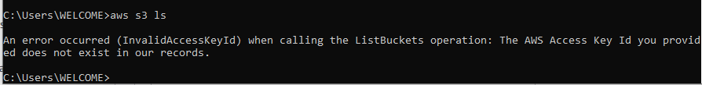
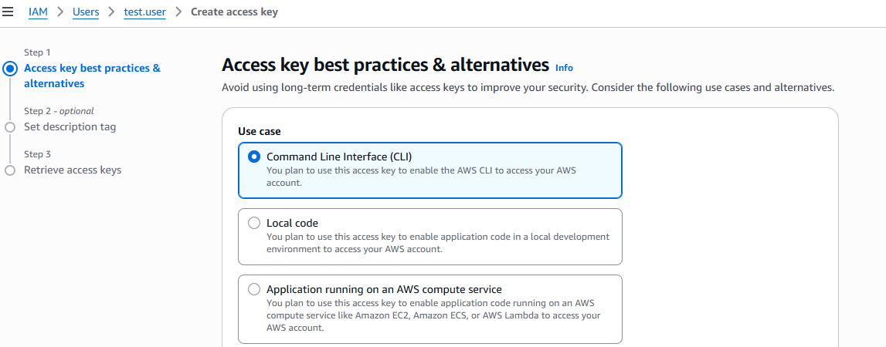
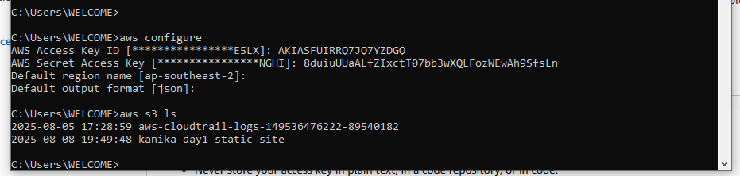

# KB Article: Incident Handling – Expired AWS Access Keys

**Author:** Kanika Arya  
**Category:** AWS IAM / Incident Management  
**Purpose:** This document describes the steps to troubleshoot and resolve a user incident caused by expired AWS access keys.

---

## Incident Summary
- **User Impacted:** test.user (IAM User)  
- **Incident Type:** Unable to access AWS resources via CLI  
- **Date/Time Reported:** YYYY-MM-DD HH:MM  
- **Priority:** Medium

---

## Problem Statement
The user could not access AWS resources using the CLI. Error messages indicated **expired credentials**.



---

## Investigation / Troubleshooting Steps
1. Reviewed the error message shown in the CLI output.  
2. Logged into AWS Console and navigated to **IAM > Users > [User] > Security credentials**.  
3. Checked **Access Keys** and confirmed that the keys were expired.  
4. Generated new **Access Keys** for the user.  



5. Guided the user to update their local AWS CLI configuration with the new keys using:  
```bash
aws configure
```
6.Tested CLI access to ensure resolution.

## Root Cause
The user's access keys had expired.
No automated reminder or rotation policy was in place.

## Resolution
Created new access keys for the user.
Updated AWS CLI configuration.
Confirmed user could access AWS resources without errors.

## Preventive Measures
Implement key rotation policy for all IAM users.
Enable alerts/notifications for expiring credentials.
Document key renewal procedures in internal knowledge base.
Schedule periodic audits of IAM user credentials.

## Key Learnings
Importance of proactive credential management.
Systematic approach to troubleshooting AWS CLI issues.
Writing clear incident reports improves team knowledge sharing.

## References
AWS KB: Managing Access Keys for IAM Users
AWS CLI Configuration Guide: https://docs.aws.amazon.com/cli/latest/userguide/cli-configure-quickstart.html
