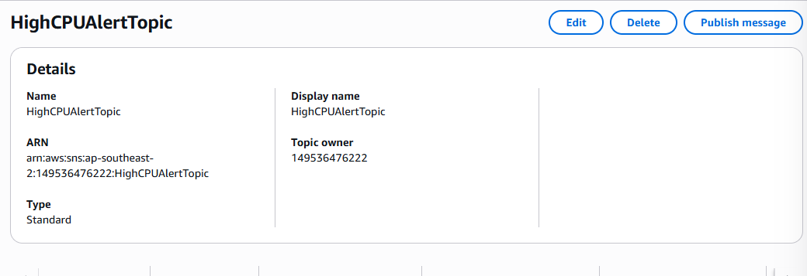
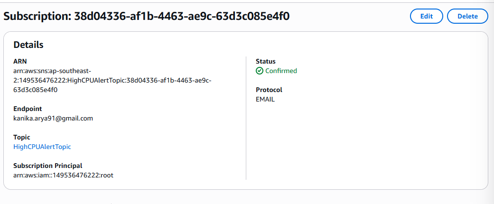
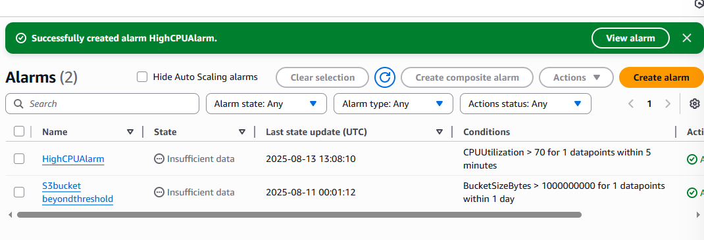
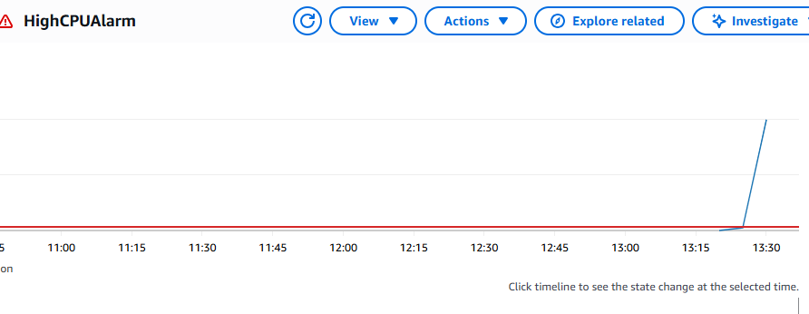

# Monitoring & Alerts Setup – AWS CloudWatch & SNS

## Project Overview
This project demonstrates how to configure AWS CloudWatch to monitor EC2 instance CPU utilization and send an SNS email alert when usage exceeds a defined threshold (70%). This proactive monitoring helps ensure system health and minimizes downtime.

## Objectives
- Configure AWS CloudWatch alarms for EC2 CPU utilization.
- Create an SNS topic and subscription for alerts.
- Trigger test alerts by simulating high CPU usage.
- Demonstrate the alert workflow from CloudWatch to email notification.

## Problem Scenario
In a production environment, a spike in CPU usage could impact performance. Without proactive alerts, administrators may not notice issues until after they affect end users.

## Steps Taken

### 1. Create SNS Topic
- Open **Amazon SNS** in AWS Console.
- Create a topic named `EC2-High-CPU-Alert`.
- Note the ARN for use in the CloudWatch alarm.
  


---

### 2. Subscribe Email to SNS Topic
- Go to **Subscriptions** under the SNS topic.
- Add your email address and select `Email` as the protocol.
- Confirm the subscription from the email received.
  


---

### 3. Create CloudWatch Alarm
- Open **CloudWatch** in AWS Console.
- Select **Alarms → Create Alarm**.
- Choose the EC2 instance metric `CPUUtilization`.
- Set threshold to **Greater than 70%**.
  


---

### 4. Configure Alarm Actions
- Under **Actions**, select **Send to an SNS topic**.
- Choose `EC2-High-CPU-Alert` SNS topic.
- Create the alarm.
  


---

### 5. Test the Alarm
- Simulate high CPU usage on the EC2 instance using a stress test command (Linux example):
  ```bash
  sudo amazon-linux-extras install epel -y
  sudo yum install stress -y
  stress --cpu 4 --timeout 300


## Troubleshooting

| Issue | Possible Cause | Resolution |
|-------|----------------|------------|
| No email received | Subscription not confirmed | Check your inbox for the AWS SNS confirmation email and click the confirmation link. |
| Alarm not triggering | CPU usage never exceeded 70% | Temporarily lower the alarm threshold or simulate CPU load. |
| SNS topic not visible in CloudWatch | IAM permissions issue | Ensure your IAM user/role has `sns:Publish` and `sns:ListTopics` permissions. |
| Alarm stuck in “Insufficient Data” | No metric data available | Verify the EC2 instance is running and CloudWatch metrics are enabled. |

---

## Key Learnings
- CloudWatch alarms help detect issues proactively before they impact end-users.
- SNS provides a quick and scalable way to notify the right stakeholders.
- Testing alerts ensures they work before real incidents occur.
- IAM permissions play a critical role in integrating services like CloudWatch and SNS.

---

## Additional Resources
- [AWS CloudWatch Alarms Documentation](https://docs.aws.amazon.com/AmazonCloudWatch/latest/monitoring/AlarmThatSendsEmail.html)  
- [Amazon SNS Documentation](https://docs.aws.amazon.com/sns/latest/dg/welcome.html)  
